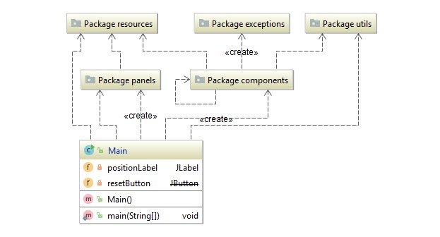
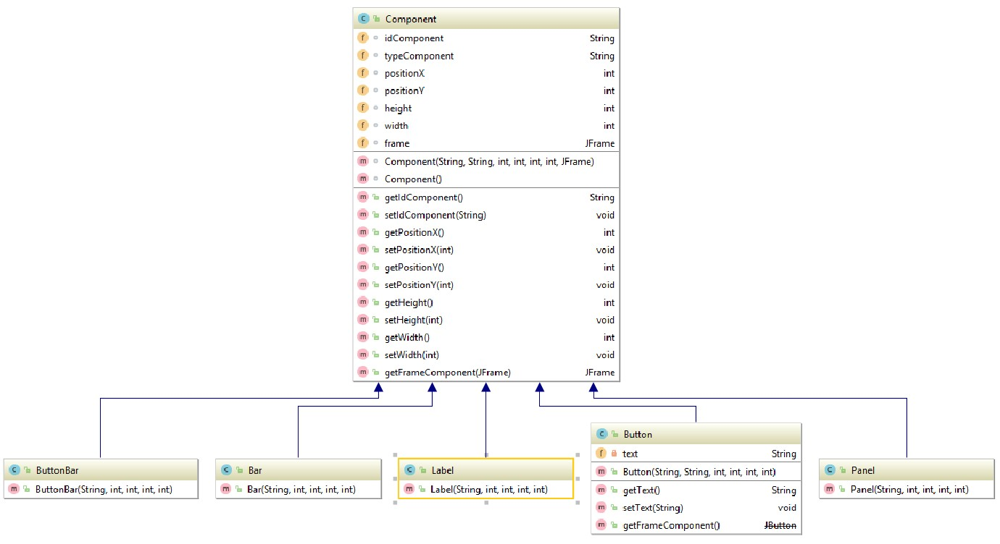
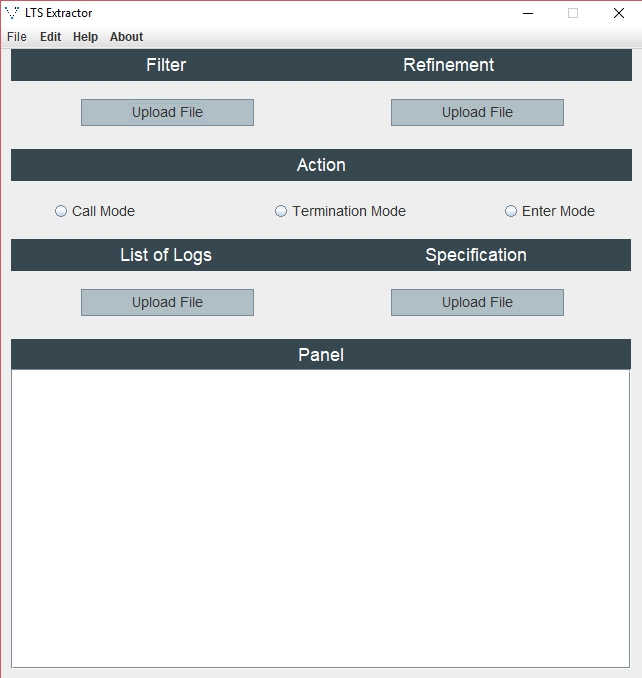

# LTS Extractor GUI

Extension for the LTS Extractor platform which is used for enabling the communication with the methods 
for generating model analysis, and to ease the management of log files throughout the platform.

__Author:__ Levindo Gabriel Taschetto Neto.

__Advisor:__ [Prof. Lucio Mauro Duarte](http://inf.ufrgs.br/~lmduarte/).
## Used technologies

*  [Javax Swing](https://docs.oracle.com/javase/7/docs/api/javax/swing/package-summary.html).

## Relationship between packages and the main class



## Relationship among the components



## Relationship among the panels

## The GUI

Partial version of the LTSE Gui v1.0 can be seen in the image below.



## Java Specifications
```
java version "1.8.0_161"
Java(TM) SE Runtime Environment (build 1.8.0_161-b12)
Java HotSpot(TM) 64-Bit Server VM (build 25.161-b12, mixed mode)
```

## How to use it separately
```terminal
$ cd ltseGui/src
$ javac Main.java
$ java Main
```
